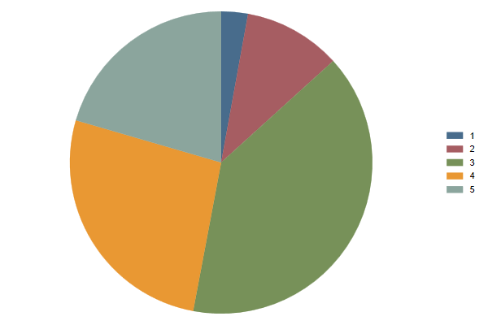
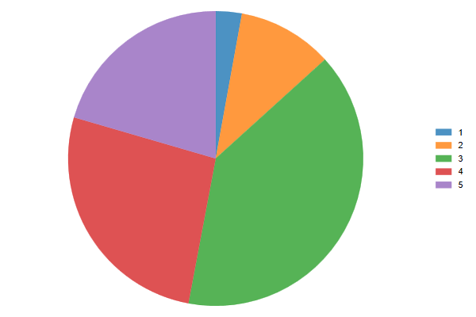
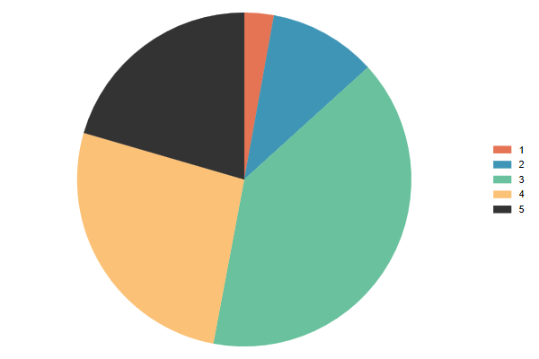
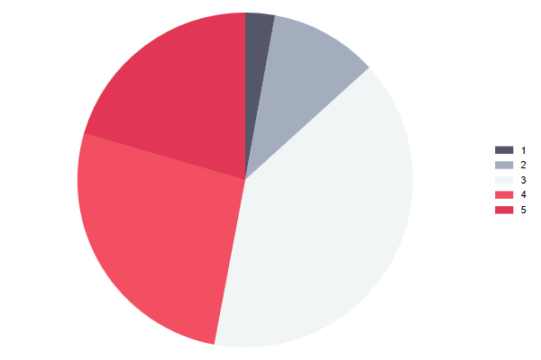
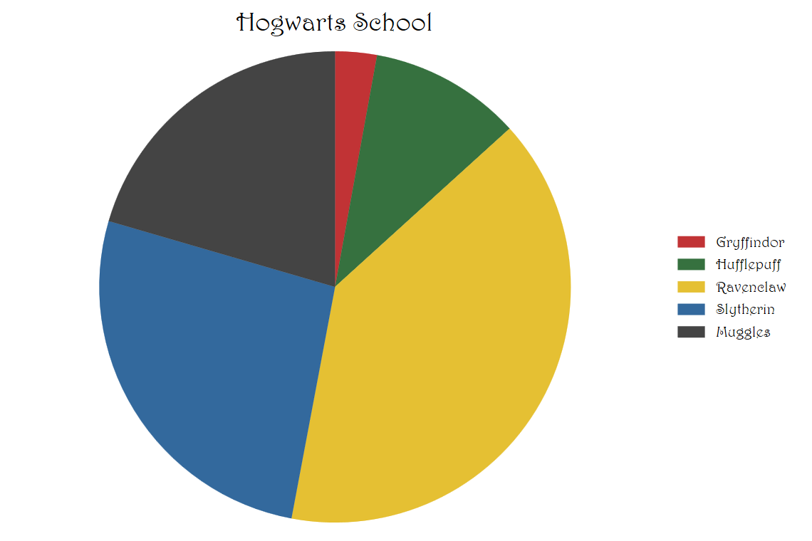
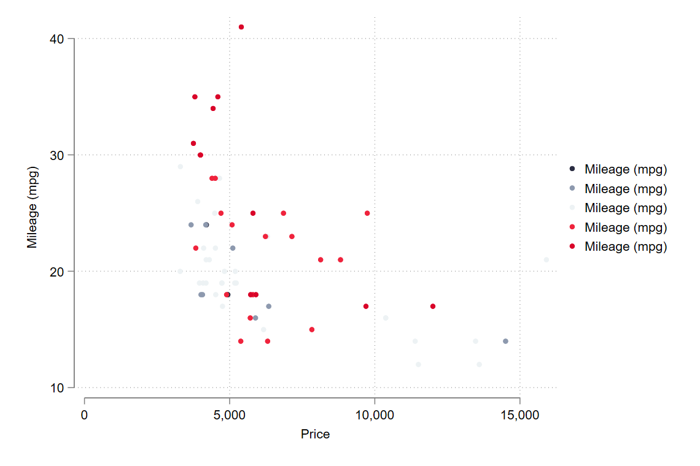
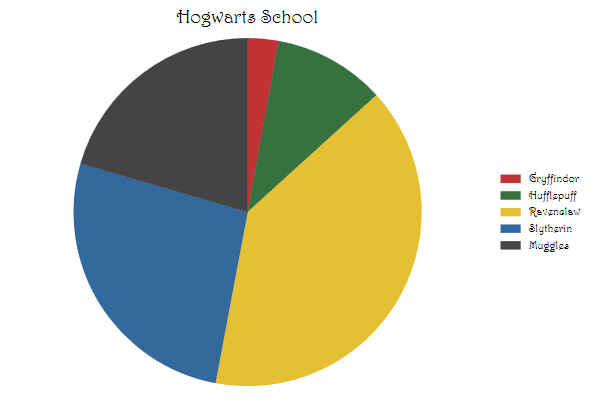

# Data Vizualizations in Stata
This is just a repository for some takes of mine on producing Data Vizualizations, inspired by Asjad Naqvi, who is trying to bring more color to your Stata visualizations. 
Enjoy!

## color_palette and font_style

This first command is a wrapper around Ben Jann's colorpalette and grstyle. It aims to provide an easy way to change colors in your favorite scheme, or even use your own. You can start by installing from ssc

```stata
ssc install color_style, replace
```


For example

```
sysuse auto, clear
set scheme white
graph pie mpg, over(rep78)
```



However, What if you do not like those colors, and prefer ... tableau.
Well, that is easy

```
color_style tableau
graph pie mpg, over(rep78)
```


But everyone uses tableau, now a days. So what about something else...Say, egypt! (suprise?)

```
color_style egypt
graph pie mpg, over(rep78)
```


But egypt only has 4 colors, and the graph requires 5. In that case, you can use colorpalette options to extrapolate!


```
color_style egypt, n(5) 
graph pie mpg, over(rep78)
```


But that isnt enough! So you look for your own palette, say this one https://coolors.co/d90429. And you apply it

```
color_style #2b2d42 #8d99ae #edf2f4 #ef233c #d10429
graph pie mpg, over(rep78)
```


This of course affects not only pies, but all other graphs! like the humble scatter:

```
two scatter mpg price if rep78==1 ///
    scatter mpg price if rep78==2 ///
    scatter mpg price if rep78==3 ///
    scatter mpg price if rep78==4 ///
    scatter mpg price if rep78==5 
```


Now, just as easy as it is to change colors, I wanted to make change fonts equality simple.
It is actually quite easy, in Stata you tye:

```
 graph set window fontface       "font name goes here"
```

but I always had to go back and remeber this. So it may be easier to remeber, the small set of words:


```
font_style Arial Narrow
* Hogwarts Colors
color_style #b20003 #044d0f #dfb000 #004485 #151515
graph pie mpg, over(rep78) title(Hogwarts School) ///
legend(order(1 "Gryffindor" 2 "Hufflepuff" 3 "Ravenclaw" 4 "Slytherin" 5 "Muggles"))
```


