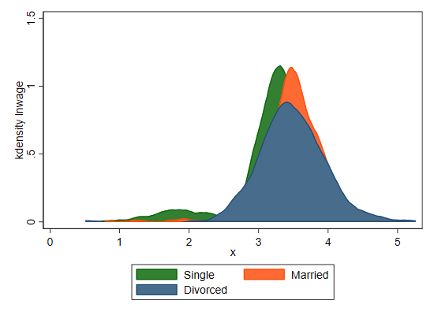
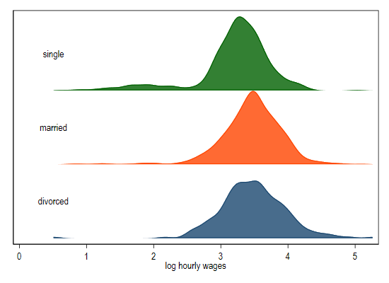
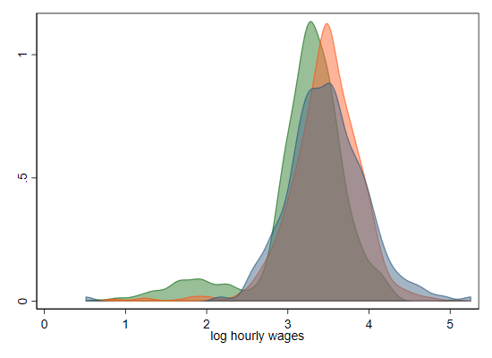
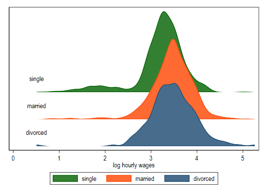
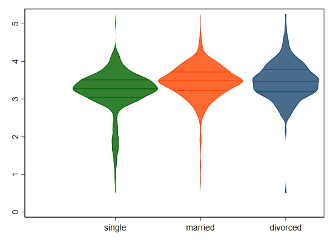
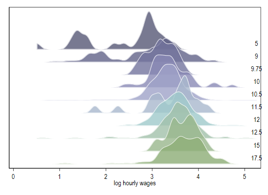

## Joyplot (or rather joy_plot)

Joyplot are also refered to ridgeline plots. From my perspective (or rather my programming perspective) these two produce considerably similar figures, but through different procedures.

If you are interested in plotting series Y across series X for multiple groups, then you want to do a ridgline plot. Instead, if what you are interested is in comparing distributions (using kernel densities) across various groups, then you want to use `joy_plot`. 

So first installation:

```
ssc install joy_plot, replace
```

## Example 

For a nice example, lets start getting some data. And one I like a lot is provided as companion of Ben Jann's `oaxaca` command.
I will also create a martial status variable to use later.

```
use http://fmwww.bc.edu/RePEc/bocode/o/oaxaca.dta, clear
set scheme s1color
gen mstatus=single +2*married +3*divorced
label define mstatus 1 single 2 married 3 divorced
label values mstatus mstatus
```

So first things first. Say you want to visually compare the distribution of wages across marital status. You could easily do that using kdensity:

```
two (kdensity lnwage if mstatus==1 , recast(area)) ///
    (kdensity lnwage if mstatus==2 , recast(area)) ///
    (kdensity lnwage if mstatus==3 , recast(area)), ///   
	legend(order(1 "Single" 2 "Married" 3 "Divorced")) 
```


Which is quite easy and quite straight forward. This new command, however, can allow you to do the same but with each density stacked at different levels:

```
joy_plot lnwage, over(mstatus)
```


Or all at the same level:

```
joy_plot lnwage, over(mstatus)  ///
color(%50) /// adding some color
gap0 // request all densities to be drawn from the same level (0)
```


However, what makes it more visually appealing is that you can also produce graphs that overlap:

```
joy_plot lnwage, over(mstatus) ///
dadj(3)  /// the hight is now 3 times the original, allowing for overlap
alegend legend(cols(3))
```


And because they are based on the same data, you can easily make violin plots:

```
joy_plot lnwage, over(mstatus) dadj(1) legend(cols(3))  violin legend(off) iqr
```


But of course, if you looking into Joyplots, what you are after is something visually shocking. So what about the following:
```
joy_plot lnwage, over(educ) dadj(3)  /// as before, with 3x the hight adjusment
bwadj2(.5) right /// setting text to the right, and using half of the automatic bandwidth
colorpalette(vangogh1, opacity(80)) lcolor(white) // and using custome palette vangogh1
```
