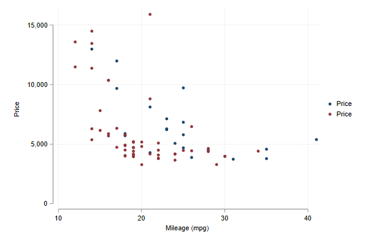
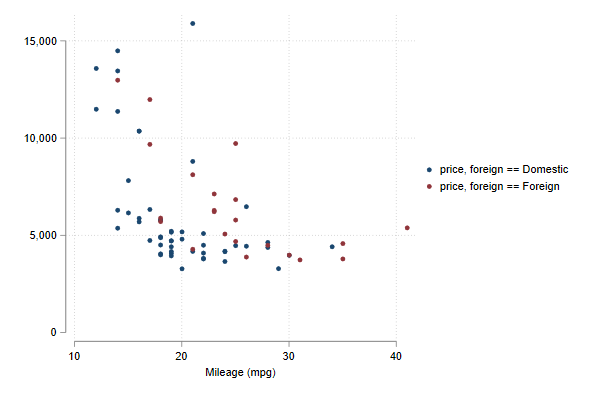

## Mscatter: Scatter with Multiple groups

So what about Scatters. Where can we improve ?
Well, there is something I always want to do, but seems hard to do everytime I try. Scatters across various groups.

```
ssc install mscatter
```

Something like this:

```
sysuse auto, clear
two scatter price mpg if foreign == 1 || ///
    scatter price mpg if foreign == 0
```


In fact, I have been pointted out to one command by Nick Cox, named linkplot.

```
ssc install linkplot
linkplot price mpg , link(foreign) asyvars recast(scatter)
```


And produces pretty much the same. The limitation, only works with up to 15 groups. But who needs more right?

Well, if you need more, you can use mscatter!

```
set scheme white   // Lets use white scheme
mscatter price mpg , over(rep78)  /// Upto here normal. I use over instead of By
alegend  legend(cols(5)) msize(3) /// add a legend with large dots
 by(foreign)  // and groups by foreign
```


But those are easy to do by hand. What if you have many groups. Lets see with some different data:

```
webuse nlswork
mscatter ln_wage ttl_exp , /// normal
over(age) /// but over many groups!
colorpalette(magma ) /// all color coded
alegend // with a legend to match
```


And as I show you before, mscatter can be combined with by()

```
mscatter ln_wage ttl_exp , over(grade) ///
 colorpalette(magma ) by(race, legend(off)) // legend(off) should go here
```


Only current limitation, you can use weights (for size of markers) but it will fail 
if you have groups without observations based on **over** and **by** (difficult to explain and reproduce)

## New update!

Two improvements with respect to previous version. 

1. You should now be able to use it with Stata v14 (or even earlier versions?)
2. You can now add fitted plots to the scatter!

```
webuse nlswork, clear
set seed 10
keep if runiform()<.2
set scheme white
color_style tableau
mscatter ln_wage ttl_exp , over(race)  ///
fit(qfitci) ///<-adds quadratic fit with CI
mfcolor(%5) mlcolor(%5) alegend ytitle("Log Wages")
```


Or take the scatterplot out!

```
set scheme white
color_style tableau
mscatter ln_wage ttl_exp , over(race)  ///
fit(qfitci) mfcolor(%5) mlcolor(%5) ///
noscatter  /// Asks not to show the scatter points
alegend ytitle("Log Wages")
```
