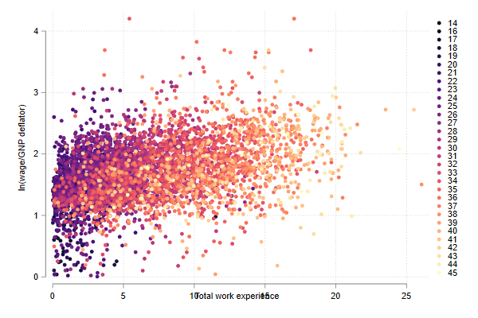

## Mscatter: Scatter with Multiple groups

So what about Scatters. Where can we improve ?
Well, there is something I always want to do, but seems hard to do everytime I try. Scatters across various groups.

```
ssc install mscatter
```

Something like this:

```
sysuse auto, clear
two scatter price mpg if foreign == 1 || ///
    scatter price mpg if foreign == 0
```


In fact, I have been pointted out to one command by Nick Cox, named linkplot.

```
ssc install linkplot
linkplot price mpg , link(foreign) asyvars recast(scatter)
```


And produces pretty much the same. The limitation, only works with up to 15 groups. But who needs more right?

Well, if you need more, you can use mscatter!

```
set scheme white   // Lets use white scheme
mscatter price mpg , over(rep78)  /// Upto here normal. I use over instead of By
alegend  legend(cols(5)) msize(3) /// add a legend with large dots
 by(foreign)  // and groups by foreign
```


But those are easy to do by hand. What if you have many groups. Lets see with some different data:

```
webuse nlswork
mscatter ln_wage ttl_exp , /// normal
over(age) /// but over many groups!
colorpalette(magma ) /// all color coded
alegend // with a legend to match
```



And as I show you before, mscatter can be combined with by()

```
mscatter ln_wage ttl_exp , over(grade) ///
 colorpalette(magma ) by(race, legend(off)) // legend(off) should go here
```

Only current limitation, you can also use weights (for size of markers) but it will fail 
if you have groups without weights (difficult to explain and reproduce)


