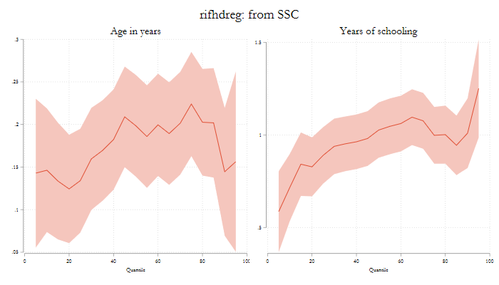

# -qregplot- : plotting quantile coefficients (update)

This page aims to show how to use qregplot, as a tool for plotting coefficients from quantile regression, which could have been obtained from many quantile type commands. 

This version provides has a few updates to make graphs better looking from the start.

This page can be considered as an extended version of the qregplot help file.

## The Setup

To work with the following examples, you will need to either or install the following:

```
ssc install qregplot, replace
ssc install mmqreg, replace
ssc install qrprocess, replace
ssc install ivqreg2, replace
ssc install qreg2, replace
ssc install xtqreg, replace
ssc install color_style
```

And, for the data, we will use a very small dataset, available from Stata datasets examples:

```
webuse womenwk, clear
set scheme white
```

## Examples

So lets start. Say that you want to estimate a model, where wages are a function of age education,  marital status, and 
county of residence.

Furthermore, lets say that we are interested in conditional quantile regressions. You could estimate this as follows:

```
qreg wage age education married i.county
```

Now wewant to plot the coefficients across the distribution for all coefficients but the county dummies.
Because I know I may have to re-edit the graphs, I'll save the coefficients into e_qreg.

```
qregplot age education married ,  /// Variables to be plotted
estore(e_qreg) /// Request Storing the variables in memory
q(5(5)95) // and indicates what quantiles to plot
```


This is a very good start. The color choice is much better than before. And notice the margins are also tight (less waiste of space).

Nevertheless, I would like to use variable labels for titles in each figure. But I dont want to re-estimate them all, but what I can do is plot "from" the stored coefficients.

```
qregplot age education married , ///
 from(e_qreg) /// <- Indicates where to look for coefficients
 label // No longer needed to add Q's and request Labels
```


If you want, you can change the color, intensity, or transparency of the confidence intervals. But if you like what you see (I do), you can just keep it.

Now, say that I want to see this, but in 3 rows. This would be a graph combine option. I will use the new syntax :

```
qregplot age education married , ///
from(e_qreg) label ///
col(1) /// request 1 column with 
 ysize(10) xsize(5) // and different sizes for the graph
```


What if you want to modify the titles to something more customized. 

```
qregplot age education married , ///
from(e_qreg) /// 
col(2)   /// and different sizes for the graph
mtitles("Age in years o Edad en años desde 1900" ///
"Años de Educacion or Years of Education, incluye Highschool" ///
"Is Married - Esta Casado") //<- ads long titles
```


So, seems that the titles are too long. So lets adjust them using labelopt(options).

```
qregplot age education married , ///
from(e_qreg) /// 
col(2)   /// and different sizes for the graph
mtitles("Age in years o Edad en años desde 1900" ///
"Años de Educacion or Years of Education, incluye Highschool" ///
"Is Married - Esta Casado") ///<- ads long titles
labelopt(lines(2)) // breaks it in two lines
```


## using Other qreg commands

Above I showed you the basic syntax for most options.
Here I will show you how easy is to apply to other commands

And to put some color on all, showcasing color_style

```
bsqreg wage age education married i.county, reps(25)
color_style bay, select(1)
qregplot age education ,  q(5(5)95) seed(101) label title("BSqreg") ///
ysize(4) xsize(7)
```


```
qreg2 wage age education married i.county, 
color_style bay, select(2)
qregplot age education , ///
 q(5(5)95) seed(101) label ///
 title("QREG2: from SSC") ///
ysize(4) xsize(7)
```


```
qrprocess wage age education married i.county, 
color_style bay, select(3)
qregplot age education ,  ///
q(5(5)95) seed(101) label ///
title("qrprocess: from SSC") ///
ysize(4) xsize(7)
```


```
mmqreg wage age education married, abs( county)
color_style bay, select(4)
qregplot age education ,  q(5(5)95) seed(101) label title("mmqreg: from SSC") ///
ysize(4) xsize(7)
```


```
rifhdreg wage age education married, abs( county) rif(q(50))
color_style bay, select(5)
qregplot age education ,  q(5(5)95) seed(101) label title("rifhdreg: from SSC") ///
ysize(4) xsize(7)
```


## Conclusions

There you have it. A small update that makes making qreg plots easy. Let me know if you have questionsor suggestions!

