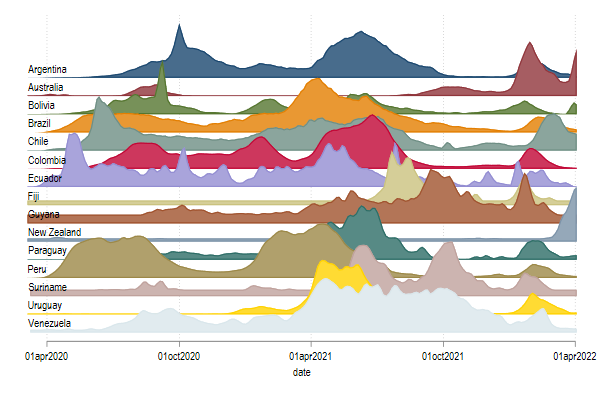
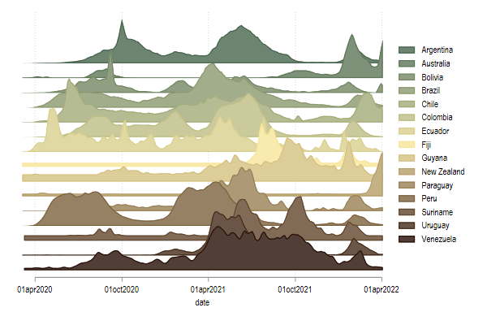
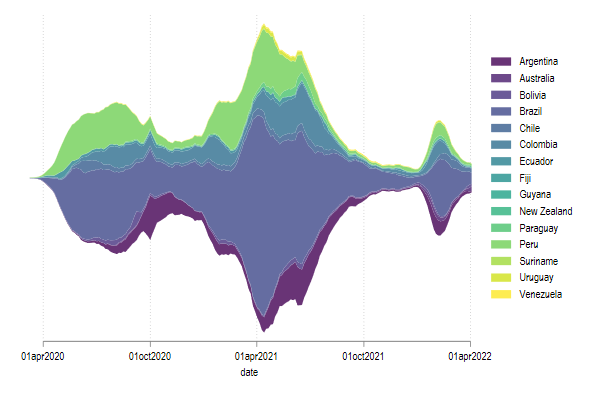
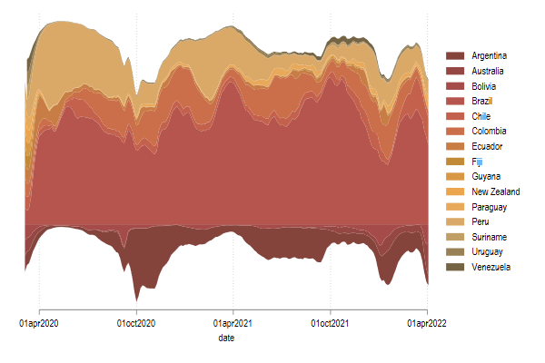

## ridgeline_plot, and its friends: 
This is the second command that is ready to be used from SSC.
Its name is ridgeline_plot. And can be used to produce plots similar to streamplots, and stack line plots.

You can start by installing it from SSC.

```stata
ssc install ridgeline_plot, replace
```

Its main caveat. It uses frames, which makes the construction of plots easy, but is only available if you use Stata 16 or higher.

If you install the full package, you will also get a snipped of Covid data, I will use for the following examples.
I ll also assume you have `color_style` installed on your computer.

### Example 

Lets start loading some data
```
use covid_small, clear
set scheme white
ridgeline_plot new_deaths date, over(country)
```


This first ridgline plot will be...ugly. Scales are all over the place

However its a start. One could, for example normalize the height for each plot, and allow for a bit more overlaping. Will also modify the text on the left so it looks better

```
ridgeline_plot new_deaths date, over(country) ///
normalize /// Normalizes height within country
textopt(size(small) placement(e)) /// changes text size
dadj(3) // and allows for overlap
```



But just one more change (or many). Use a different palette, and use legends instead of text.

```
color_style shakira, n(15)
ridgeline_plot new_deaths date, over(country) ///
normalize /// Normalizes height within country
notext alegend /// automatic legend
dadj(3) // and allows for overlap
```


And starts to look good. Limitation, color_style only modifies first 15 colors. So if you have more groups, some labels will not come up. 

Solution? use colorpalette from the command! Also, lets change to stackline :

```
ridgeline_plot new_deaths date, over(country) ///
notext alegend /// automatic legend
stack colorpalette(daddy2) lwidth(0)
```


But you probably want streamplots...So lets try something differnt.
either a simple streamplot (centered at zero)
```
ridgeline_plot new_deaths date, over(country) ///
notext alegend /// automatic legend
stream /// producing a stream plot (sort of)
colorpalette(viridis) lwidth(0) // with viridis palette 
```



or centered at some other group. (also switching to stack 100!)


```
ridgeline_plot new_deaths date, over(country) ///
notext alegend /// automatic legend
stream(3)   /// Stream using group 3 as zero
stack100    /// but stacking so yo only see percentages
colorpalette(peru2) lwidth(0) ///
ylabel("")
```



