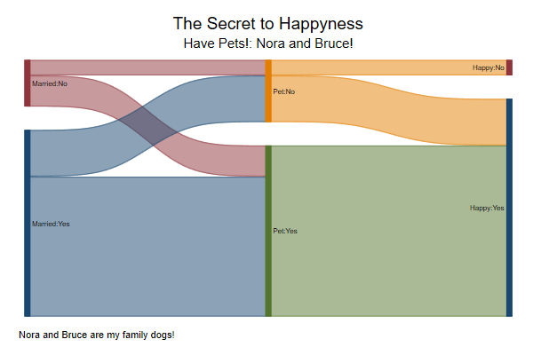

## Sankey plot

This has a particular spot on this repository, because is the one that Asjad ask me to try and replicate. 
He has very nice notes, where they shows how to build them from scratch, but for regular users, those can be tedious to follow and implement.

So, the command `sankey_plot`, emerge.

```
ssc install sankey_plot, all
```

I use `all` because it comes with some useful example datasets.

Now, what is a sankey plot, and how to use it? I provided some streamline explanation of what they are in my [site](https://friosavila.github.io/playingwithstata/main_sankey.html).
But, here is the showcase! 

Although its important to mention. Sankey_plots are just beefed up pair coordinated plots, where nodes are connected, and where the width of the connections typically indicate the amount of flow from one node to the other.

Now, there are two ways of using the command. Although one is still experimental. So let me go through them

### Option 1. Flows across 2 (or more) nodes

In the first version, you always need to provide the full "node" coordinate. x's and y's, if you prefer. So lets plot a flow of immigration across continents

```
use immigration, clear
sankey_plot x0 from x1 to, /// coordinates for levels (x0 x1) and the from to data
width0(value)  /// value of the flows, (migration)
xsize(4) ysize(6) /// adjusting size of plot
extra // Because we are using width, it is often recommended to use this for automatic adjustment.
```


Of course, we could just manually adjust the height of the nodes, without need of "extra"
But I will use adjust, so flows do not overlap

```
egen fcode=group(from)
egen tcode=group(to)
replace fcode=fcode*10
replace tcode=tcode*10
sankey_plot x0 fcode x1 tcode, /// coordinates for levels (x0 x1) and the from to data
width0(value)  /// value of the flows, (migration)
label0(from) label1(to) /// Labels for 
xsize(4) ysize(6) /// Adjusting x and y size
adjust // Because we are using width, it is often recommended to use this for automatic adjustment.
```


## Option 2: Multiple levels

You can also use Snakey for Multiple levels flows. 
take, for example, the "jobmarket.dta"

```
use jobmarket.dta
sankey_plot week0 y0 week1 y1, ///
width0(candidates) adjust extra /// Weight of # of candidates
label0(label0) label1(label1) /// labels for events
xlabel(0 "Starts" 1 "Week 1" 2 "Week 2" 3 "Week 3" 4 "Week 4" 5 "Week 5" 6 "Week 6") ///
fillcolor(gs10%40) gap(.2) /// a single color to all flows
xsize(8) ysize(5) // size change
```


## Experimental: Wide data

Finally, you have the **experimental** option of using wide data:

```
use dogs_and_happiness, clear
list

     |     married       pet       happy   freq |
     |------------------------------------------|
  1. | Married:Yes   Pet:Yes   Happy:Yes      5 |
  2. | Married:Yes   Pet:Yes   Happy:Yes      4 |
  3. | Married:Yes    Pet:No   Happy:Yes      3 |
  4. |  Married:No   Pet:Yes   Happy:Yes      2 |
  5. |  Married:No    Pet:No    Happy:No      1 |
```

In this case, you do not need to specify levels (x's). They are taken directly from the order you enter the data.

```
sankey_plot married pet happy , ///
wide width(freq) /// Need to indicate the data is wide, and notice its width() is not width0()
fillcolor(%50) xlabel("",nogrid) gap(0.1) tight /// Tight groups things together
title("The Secret to Happyness") ///
subtitle("Have Pets!: Nora and Bruce!") note("Nora and Bruce are my family dogs!")
```


