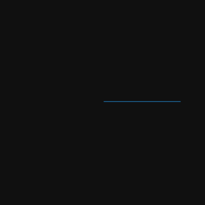
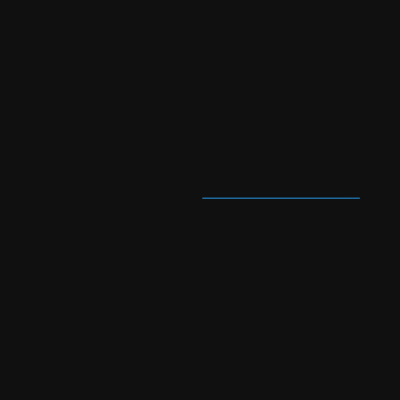
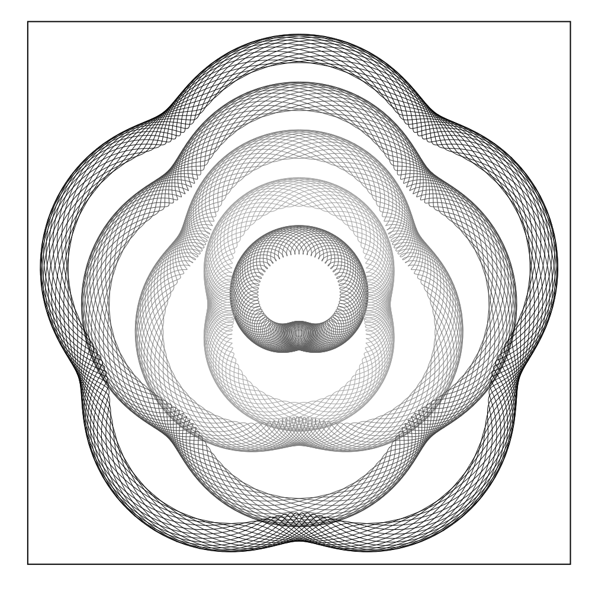
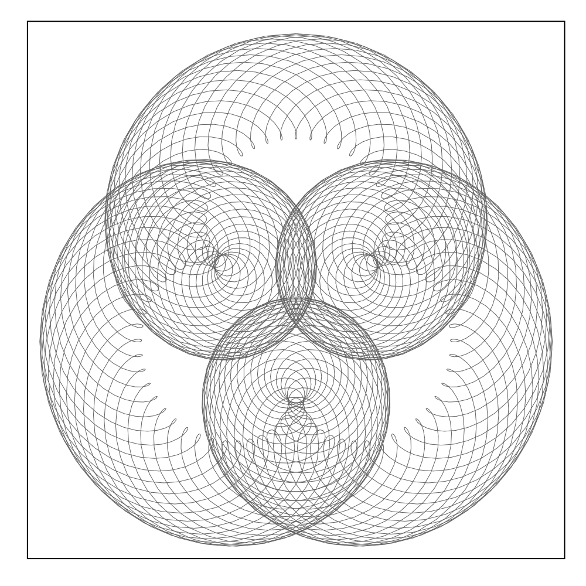
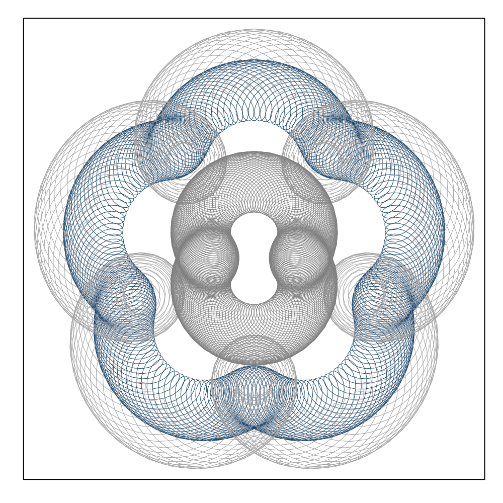

## Bonus Spirographs!

This last one is a bonus. As no helpfile exists, but you can get the ado file from this repository.

Also, this one comes with explanations!

### What are they?

I believe the correct term for this is Guilloche pattern. From a programming perspective these are figures created by drawing circles, within circles, within circles. 

So how does this work? 

First, we need to change the perspective from a cartesian coordinates (x,y), to one with polar coordinates, where every point in space is determined by a distance to the origin ($r$), and the angle of that a line that connect it to the origin, with respect to the horizon.

Specifically: 

$$x_0 = r_0 * cos \gamma_0$$
$$y_0 = r_0 * sin \gamma_0$$

So, if we fixed $r$, and let $\gamma$ vary, from 0 to $2 \pi$. We can draw a simple circle:



Now, what if we add another component here. where we start drawing another circle, but the point of reference (origin) is constantly changing (moving around) as above:

The possition of this new point will be:

$$x_1 = r_0 * cos \gamma_0+r_1 * cos \gamma_1$$
$$y_1 = r_0 * sin \gamma_0+r_1 * sin \gamma_1$$

If $\gamma_0$ and $\gamma_1$ change at the same speed, you probaly see nothing but a longer circle. However, if they move at different speeds:



You could think of this as the movements of earth around the sun, and the moon around earth. But why stop there? what if there is one more component moving!


The last component adds even more complexity and chaos! Now if we trace the movements of that last piece, then we would find this beatiful looking spirographs (get a copy of the ado above):

So what is the syntax?
```
spirograph, r(numlist) /// this represent the radious r
s(numlist) /// and this the speed of change or the angle gamma
rotation(#) /// you can indicate how many "rotations" you want to use
adjust(#) /// and how many points per rotation to use. (higher=smoother)
lwidth(#) /// width of the line
default   /// to set default look
color(color list) /// to provide a list of colors, if necessary
```

You can use the options `r()` and `s()` up to 9 times, so you can produce up to 9 different drawings in the same graph.

See a few examples:

```
spyrograph, r(1 .3 .35 ) s(1 6.05 2 )  ///
			 r(1 .3 .35 ) s(1 6.05 3 )  ///
			 r(2 .3 .35 ) s(1 7.05 4 ) ///
			 r(3 .3 .35 ) s(1 7.05 5 ) ///
			 r(4 .3 .35 ) s(1 7.05 6 ) rotation(20) adjust(5) default lwidth(.1)
```


```
set scheme white_tableau
spyrograph, r(5 .43 1.35 ) s(1 6.05 1.95 )  ///
			rotation(20) adjust(5) default lwidth(.1)
```


```
spirograph, r(5 .5   1  )  s(1 6   12.05   )  ///
			r(5 1.5   1 )  s(1 6   12.05   )  ///
			r(2 .5   1  )  s(2 6   11.05   )  ///
			rotation(20) adjust(5) default lwidth(.1) color(navy)
```
